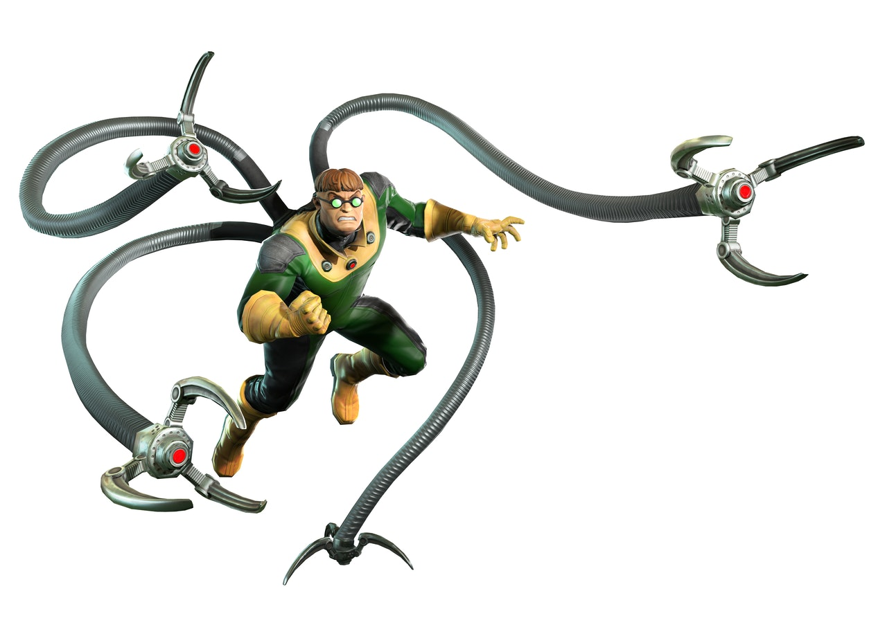

# refinery-doc-ock 

Usage statistics collection for [refinery](https://github.com/code-kern-ai/refinery). If users allow it, this collects product insight data used to optimize the user experience.

If you like what we're working on, please leave a ⭐ for [refinery](https://github.com/code-kern-ai/refinery)!

Named after Dr. Otto Octavius from Spiderman 🤓

